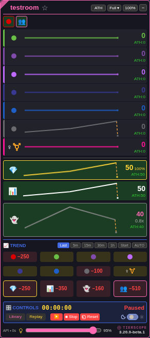

# Audience trends and Anons ratio — 3.20.0-beta.1

[Install the beta](https://raw.githubusercontent.com/newivy2/TierScope/beta/trends-audience-ratio/tierscope.user.js). Keep one enabled copy of TierScope and refresh room tabs after updating. Main remains on 3.19.0 while this update is reviewed.

The bottom trend row now contains four larger boxes: **With Tokens** (yellow border), **Registered**, **Anons**, and **Room Total** (pink border). Room Total compares registered plus anonymous viewers against the same selected previous sample or time window as the other boxes. Backgrounds still mean increase (green), decrease (red), or unchanged (yellow).

All three trend rows have four columns. The bottom boxes are taller, and number sizes adjust to fit. Large deltas use the existing `k`/`m` shorthand; hover a box for its exact current, previous and change values.

The expanded **Anons** tier shows **Anons ÷ registered viewers** between its count and SH/ATH. For example, 80 Anons and 100 registered viewers displays **0.8x**; 120 and 100 displays **1.2x**. Ratios from **0.95 through 1.05** display **1:1**. With no registered viewers the ratio is **—**, because division by zero is unavailable. The ratio follows the displayed sample in live tracking, restored sessions and ordinary/file replay; switching SH/ATH does not affect it.

To review, expand Anons from its collapsed marker, watch the ratio and fourth trend box after a scan, change the trend comparison window, and try both themes and different panel scales. In Replay, step through samples with different anonymous/registered counts. Live scans should not change the replayed ratio.

[Bright-theme preview](previews/audience-trends-bright.png)
