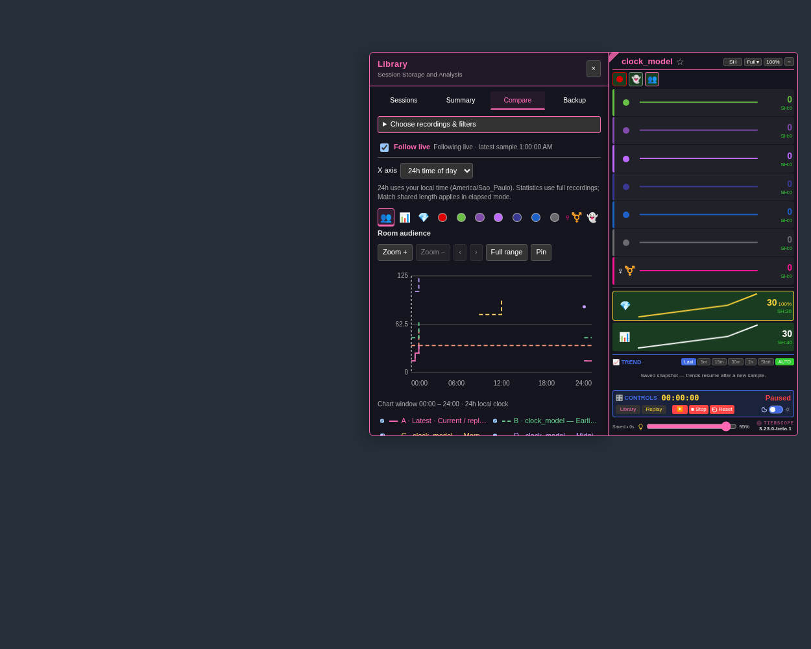

# 24h comparison — 3.23.0

[Install TierScope](https://raw.githubusercontent.com/newivy2/TierScope/main/tierscope.user.js). Keep one enabled copy of TierScope and refresh room tabs. [Release notes](https://github.com/newivy2/TierScope/releases/tag/v3.23.0).

Open **Library → Compare**, select two to twelve sessions, and choose **X axis → 24h time of day**. Sessions align on the same local clock from **00:00 to 24:00**, making it easier to compare audiences at similar times on different dates.

- A session from 23:00 to 01:00 appears at the right edge and continues at the left. There is no line joining the edges through the middle of the chart.
- Gaps remain blank. Counts are held only between accepted samples in recorded intervals; the final sample adds no assumed duration.
- Inspection shows original dates, clock offsets and sample numbers. Repeated times may show multiple dated values. Daylight-saving jumps split drawing paths.
- Statistics use full sessions with real timestamps and session gaps. **Match shared length** applies only to Elapsed time; its previous choice is retained.
- Sessions over 24 real hours cannot use this chart mode. Exactly 24 hours is allowed. Known session starts and active duration count toward the limit; a later export date does not.
- A followed live session that becomes too long shows an explanation. Its reports keep updating, and Elapsed time remains available.

Zoom, pan, pinning, metric icons and line visibility work in both modes. Switching axes resets zoom and cursor position but retains hidden lines. The newest line remains solid pink and earlier sessions remain dashed. The axis choice lasts while Library is open; reopening starts in Elapsed time.

Model cards in Sessions Book also show **First**, **Latest** and **Total covered time** for sessions matching your filters. Covered time excludes session gaps and the time after the last sample. Overlapping sessions count separately. Saved sessions and file formats require no migration.

[Bright-theme preview](previews/clock-comparison-bright.png)
