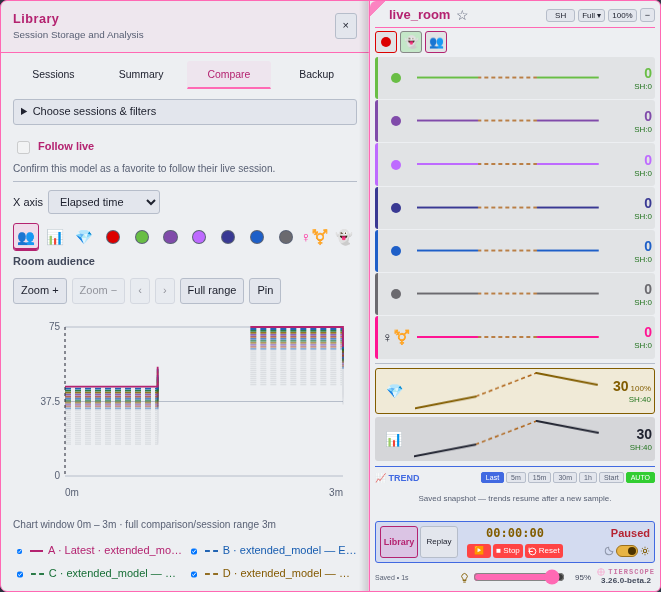

# Comparison fading and history shadows — 3.26.0

Compare up to **30 sessions from one model**, or **12 sessions across different models**, in Library. The newest session stays solid pink and fully opaque. The next eleven sessions are dashed and fade gradually through **95%, 90%, 85%, 80%, 75%, 70%, 65%, 60%, 55%, 50% and 45% opacity**.

Sessions 13–30 form a thin, neutral background at **12% opacity**. Their traces are composed together before the opacity is applied, so many overlapping sessions cannot turn the background into an opaque band. Dates determine each style; reordering or hiding a session does not promote older lines or reassign their appearance. Tied dates retain the existing slot-order tie-breaker.

**Compare with previous** selects the current/selected session and up to 29 earlier sessions from the same model. Model-card **Compare** selects up to 30 newest stored sessions from that model. Manual selections can mix models up to twelve sessions; larger comparisons must use one model. Add session follows this rule and skips unrelated sessions when expanding beyond twelve. If a changed slot introduces another model into a larger comparison, the chart shows an explanation until the selection is corrected. No sessions are silently removed. Slot labels continue from A–Z to AA–AD.

All selected sessions remain available in the shared cursor table, visibility controls and statistics, including the faint background sessions. Every visible session still contributes to the chart scale. Real timestamps, gaps, shared-length clipping and 24h comparisons keep their existing behavior. Hiding lines changes presentation and inspection; it does not exclude sessions from summary calculations.

To review, compare two or six sessions to see fading begin immediately. Try twelve across models and thirty from one model, switch themes and time axes, reorder slots and hide foreground/background lines. Check that thirteen sessions across models are blocked, including sessions hidden by Library filters; exporting those selections remains available. Inspect gaps and single samples, and try both model-card Compare and Compare with previous. Stored formats, automatic keeping and the live panel remain unchanged.

[Dark-mode preview, with slots reordered](previews/comparison-shadow-dark.png).

## Performance check

Chromium, 4× CPU throttling, three fresh-page rounds per case. Median measurements below use 10,000 samples per selected session. They are synthetic observations, not device guarantees.

| Selected sessions | Open comparison | Metric change | Full-range redraw | Cursor inspection p95 |
| --- | --- | --- | --- | --- |
| 12 | 855 ms | 750 ms | 774 ms | 8.5 ms |
| 30 | 2076 ms | 1923 ms | 1761 ms | 8.9 ms |

Thirty long sessions increase initial chart and redraw costs; cursor inspection reuses the bitmap and stays much cheaper. Zoomed drawing uses the existing sample reduction while inspection and statistics retain full-resolution data. [Raw measurements](benchmarks/compare-3.26.0-beta.1.json).
