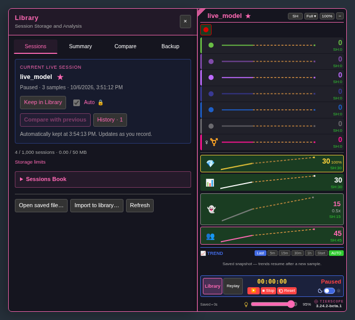

# Control panel layout — 3.24.2

The visible Controls title and icon are removed. The elapsed timer sits at the center of the timing row, with scan status on the right. Both keep reserved space so changing time or status text does not shift the controls.

Library and Replay are tall buttons on the left, spanning the height of the control area's two rows. Library has a pink border, tinted background and bold label; Replay uses a neutral background and border. Play/pause, Stop, Reset and the theme switch retain their previous layout. The panel and control area retain their existing height.

Inside Library, **Keep in Library** has the same border and background as **History**, for both the current and replayed session cards. **Compare with previous** retains its existing emphasis.

To check the layout, use the panel in dark and bright modes, try the Library and Replay buttons, and use play/pause, Stop and Reset. Check the current-session and replay cards in Library. Scaled panels, keyboard navigation and compact mode retain their existing behavior.

[Bright-theme preview](previews/control-panel-beta-bright.png)
