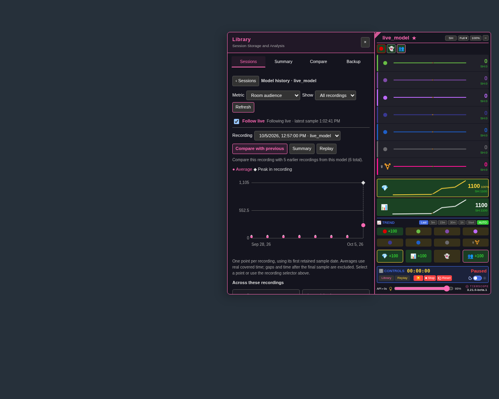

# Follow live — 3.21.0-beta.1

[Install the beta](https://raw.githubusercontent.com/newivy2/TierScope/beta/follow-live-analysis/tierscope.user.js). Keep one enabled copy and refresh room tabs after updating. Main remains on 3.20.0 during review.

**Follow live** appears above the chart in Summary, Compare and Model History. It starts on when the view includes the actively tracked session of a model whose favorite/automatic-keeping setting has been confirmed.

- **Summary:** the current session's chart, audience statistics and average-based thresholds update after accepted scans. Applied custom thresholds and unfinished threshold edits are preserved during updates.
- **Compare:** the current session's line grows alongside the selected earlier recordings. Zoom, cursor/pinning, hidden lines, selected recordings and threshold edits stay in place. **Match shared length** still restricts the chart and statistics to the shortest recording; turn it off to see the live session extend beyond that point.
- **Model History:** the current kept session's average/peak point and aggregate statistics update, while the selected recording and expanded table remain in place.

Turn **Follow live** off to freeze that view for inspection; turn it on again to catch up. Each view keeps its own setting while Library is open. Full-range charts grow with the recording; a zoomed window stays where you placed it, within the available range.

Updates use new scans in this tab, including scans received while a separate file is replaying. A file-replay source itself stays a snapshot. Favoriting does not scan unopened rooms. A Reset stops following the old session; select or refresh the new recording and turn Follow live on to follow it. Removing the favorite or losing access to its setting freezes the view.

Chart updates do not trigger extra scans or Library writes. Automatic keeping keeps its existing cadence. A pending Library save is shown separately: the chart can include live samples that have not yet been saved. Statistics continue to use real timestamps and exclude recording gaps.

In **Current Live Session**, **Compare with previous** is now the primary pink-bordered button. **Keep in Library** has no visible border. Both retain their positions.

To review:

1. Open a confirmed favorite with a current session. Open Summary and watch its sample count after a scan.
2. Use Compare with previous, turn off Match shared length if needed, and zoom or hide a line. Check that new scans preserve those controls.
3. Switch Follow live off, wait for another scan, and switch it on again to catch up.
4. Open History and select an older recording. Its details should stay fixed while the current session's point and overall statistics update.
5. Check both themes and the updated Current Live Session button styling.

[Bright-theme preview](previews/follow-live-history-bright.png)
