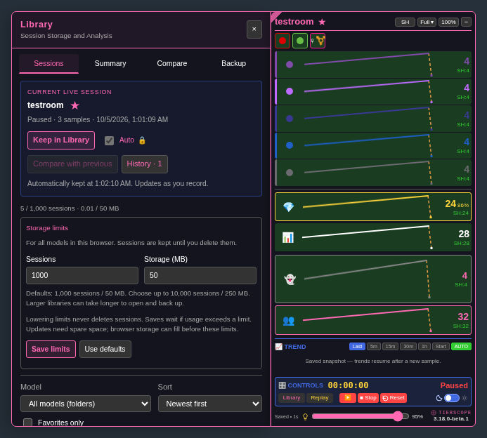

# Configurable Library storage — 3.18.0-beta.1

[Install the beta](https://raw.githubusercontent.com/newivy2/TierScope/beta/library-capacity/tierscope.user.js). Keep one enabled copy of TierScope and refresh room tabs after updating. Main remains 3.17.0.

The Library now defaults to **1,000 sessions / 50 MB**. Existing recordings stay where they are.

Open **Library → Sessions → Storage limits**, below the usage counter, to choose the session count and storage allowance. You can set **1–10,000 sessions** and **1–250 MB**. Click **Save limits** to apply them. **Use defaults** fills the original values for you to save.

- Limits apply across all models in this browser. No recordings are automatically deleted, even if you lower the limits below current usage.
- A warning appears at 80% of either limit. Automatic keeping updates the counter and warning while preserving settings you are editing.
- When full, saves report the problem and keep the previous recording. Raise the limits or export/remove sessions, then retry. Updates need temporary room for the replacement.
- Backup and bulk-import handling supports **300 MB / 10,000 sessions**. Opening a backup does not change your limits; restore checks available capacity before changing any data. Limits stay local to this browser.
- A failed settings save keeps your entered values available for retry. Browser storage can still fill before your chosen allowance.

Larger libraries can take longer to open and back up. [Performance measurements](../PERFORMANCE.md) describe the 1,000-session fixture and its limits.

[Bright-theme preview](previews/library-capacity-bright.png)

To review: change both limits, close and reopen Library, and check that they persist. Try Use defaults followed by Save limits. Lower the session count below your stored count: recordings should remain accessible and new saves should report that the Library is full. Raise it again and use Retry keeping if Auto has a pending save.
