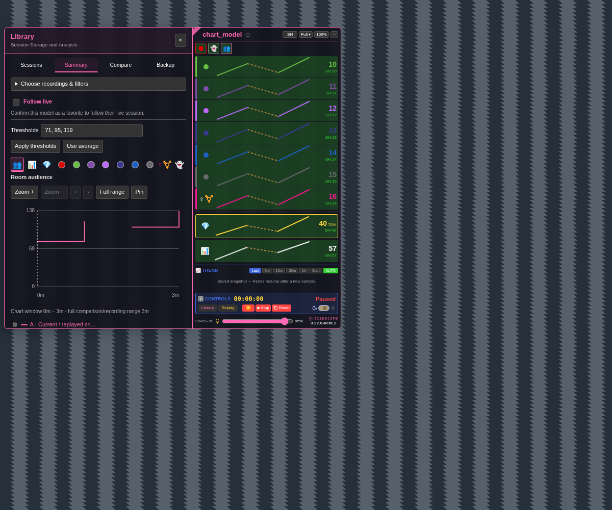

# Library chart controls — 3.22.0-beta.1

[Install the beta](https://raw.githubusercontent.com/newivy2/TierScope/beta/library-chart-controls/tierscope.user.js). Keep one enabled copy and refresh room tabs after updating. Main remains on 3.21.0 during review.

The background transparency slider now affects Library as well as the Scope. Text, charts and controls stay fully visible. Both themes follow the slider, including when you reopen Library.

Summary, Compare and Model History use an icon strip above the chart to select one metric at a time. The order matches the previous dropdown: Room audience, Registered viewers, Viewers with tokens, Moderators, Fan club, Dark purple, Light purple, Dark blue, Light blue, Grey, Female / trans and Anonymous viewers. Room audience is the default; explicit metric choices remain remembered.

- Hover an icon for its name. The active icon has a pink outline and its name below the strip.
- Tab enters at the selected icon. Arrow keys switch metrics; Home/End select the first/last.
- Narrow Library views wrap the strip into two rows without changing the order.
- **Match shared length** now sits below the Compare chart and legend, before inspection and statistics.

Metric changes retain Summary/Compare chart zoom, cursor and hidden lines. Follow live, real timestamps, recording gaps and stored recordings keep their existing behavior.

To review, try each analysis view, toggle a few metrics, adjust transparency in both themes, and resize the browser or panel. Check the comparison range with Match shared length on and off.

[Bright-theme preview](previews/library-chart-controls-bright.png)
