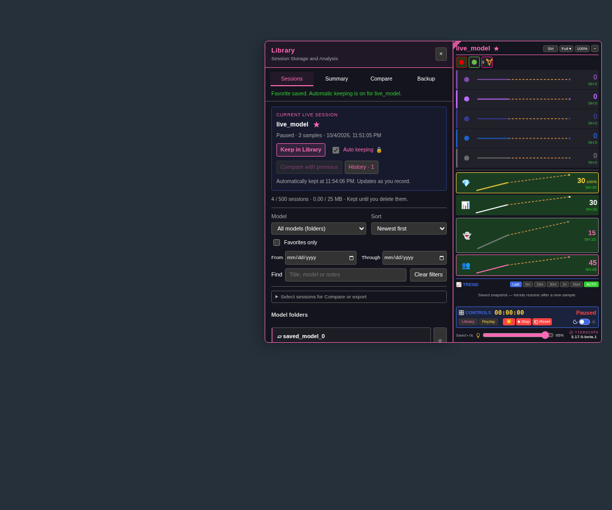
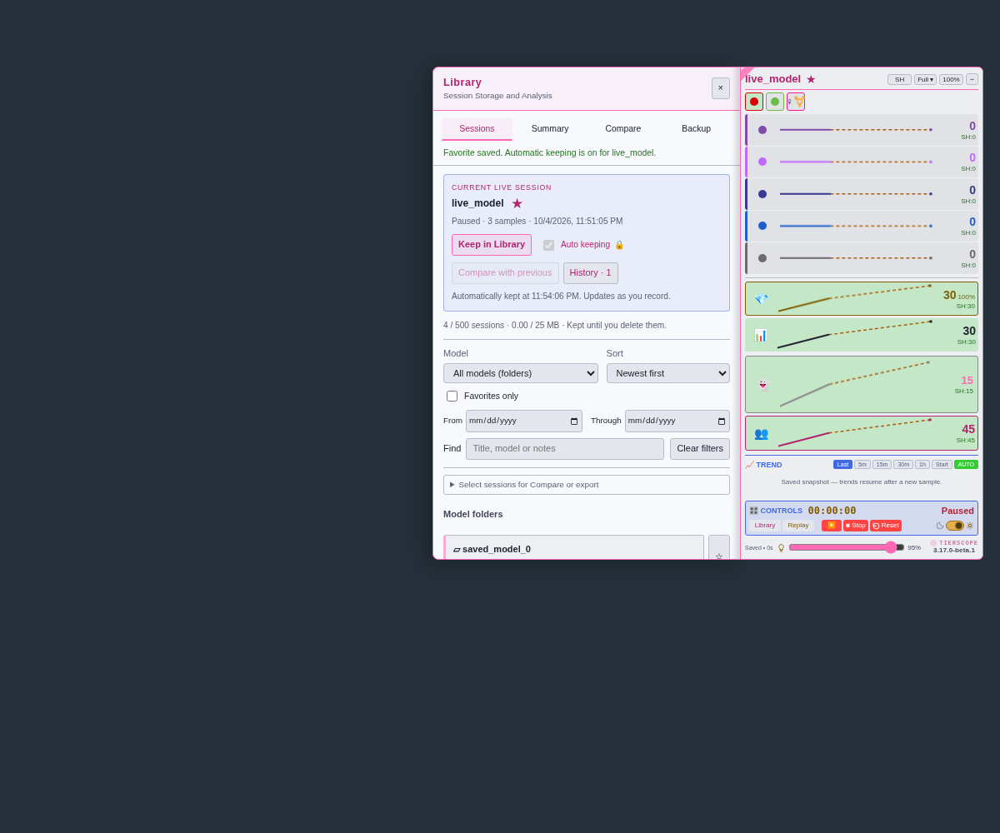

# Library live controls — 3.17.0-beta.1

[Install beta](https://raw.githubusercontent.com/newivy2/TierScope/beta/library-live-controls/tierscope.user.js). Main remains on 3.16.1 during review. Keep one enabled copy of TierScope.

Current Live Session now contains **Keep in Library**, **Auto keeping**, **Compare with previous**, and **History** with its saved-session count. Save file, TXT, CSV, GIF and Add to ATH remain available under each stored session’s **More…** menu and on the separate replay card.

- **Auto keeping** reflects the model’s confirmed favorite setting. Clicking it while off opens the favorite confirmation; cancelling leaves it off. When enabled it is checked and locked. Remove the model’s star to stop automatic keeping without deleting saved sessions. Existing or imported favorites still need individual confirmation.
- **Compare with previous** captures the live session and selects up to five earlier saved sessions for the same model, six total. Saved copies with the same session start are excluded, including after retained-history rollover. The comparison does not save the live snapshot and never uses another model’s replay as its source. It stays fixed as live samples arrive or replay closes; **Refresh live snapshot** in the recording picker captures a new snapshot. The button explains when no earlier sessions are available.
- The session/storage counter leads directly into model selection, sorting, filters and the session list. **Open saved file…**, **Import to library…** and **Refresh** are at the bottom.

To review: try the checkbox on a non-favorite, cancel, then confirm it; remove the star to unlock it. On a model with earlier sessions, compare while replaying another model and verify that slot A remains the live snapshot. Keep a session, open its More… menu and check downloads. Try dark/bright themes and narrow windows.

