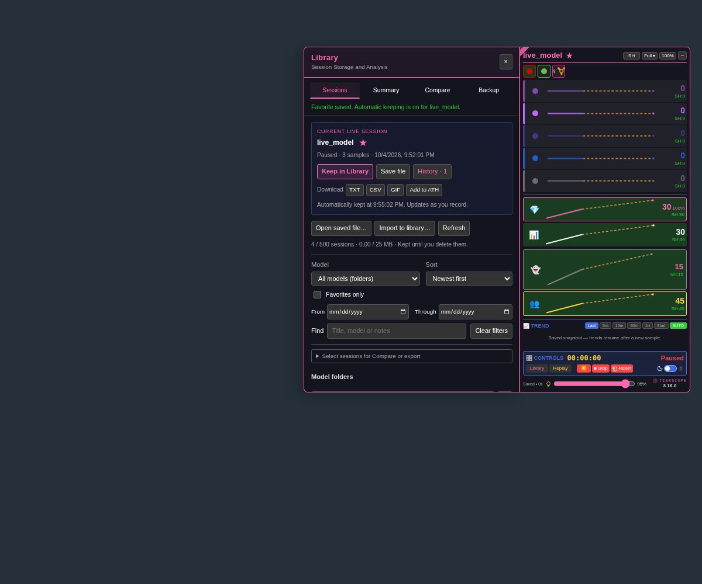
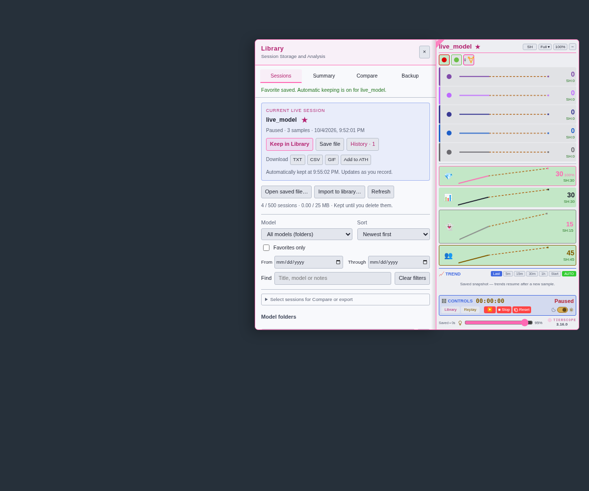

# Model Library — 3.16.0

[Install 3.16.0](https://raw.githubusercontent.com/newivy2/TierScope/main/tierscope.user.js) · [Release notes](https://github.com/newivy2/TierScope/releases/tag/v3.16.0). Keep one enabled copy of TierScope.

- **Library / Session Storage and Analysis** with Sessions, Summary, Compare and Backup tabs.
- Current Live Session first, star beside the model, History/count beside Save file, and a separate replay card.
- Confirm a favorite to keep their live sessions automatically. Existing/imported stars stay manual until **Enable automatic keeping…** is confirmed for that model. Unstarring stops keeping without deleting sessions.
- Periodic checkpoints update the same compatible session, preserving names, notes and drafts; pause, Stop, Reset and navigation preserve the departing live session. Replay files still need an explicit Keep action.
- Larger model-name header with an adjacent star and a bold, higher-contrast version below the logo; **Room Total (👥)** in yellow below Anons (darker gold in bright mode) with chart, high and pulses. Female/Trans starts collapsed unless a saved layout says otherwise.
- Model/sort controls together, Favorites only, one date row, and expandable bulk-selection controls.

The existing 500-session/25-MB Library and retained-sample limits apply. Full/failed writes preserve previous data, show pending feedback and offer retry. A forced browser termination may lose changes since the last checkpoint. Favorites travel in backups; permission to keep automatically must be confirmed again on a new browser. Large-library checkpoints can briefly pause slower devices; see the [measurements and limits](../PERFORMANCE.md#automatic-favorite-checkpoints--3160-beta1).

To review: confirm a model’s star, let it record, open Library, and check that the same session grows. Pause/Stop and inspect its latest snapshot. Open a different model’s replay and verify that both cards export their labeled model. Test the default collapsed rows, Room Total SH/ATH, and filters in dark and bright themes.

