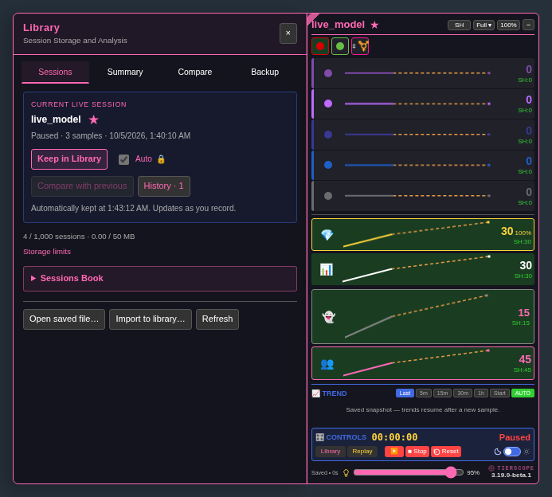

# Sessions Book — 3.19.0-beta.1

[Install the beta](https://raw.githubusercontent.com/newivy2/TierScope/beta/sessions-book/tierscope.user.js). Keep one enabled copy of TierScope and refresh room tabs after updating. The official main release remains 3.18.0.

The Sessions tab keeps **Current Live Session**, the session/storage counters and **Storage limits** at the top. Below them, **Sessions Book** starts collapsed. Expand it to browse your existing model folders and stored sessions.

The book starts with a separate collapsed **Search & sort** menu. All existing model, sorting, favorites, date and text filters are here. Closing search keeps your filters applied, with a visible “Filters active” reminder. Session selection, comparison, notes, replay and exports remain available inside the book. **Open saved file**, **Import to library** and **Refresh** stay outside it at the bottom.

Expanded sections and browsing choices survive Refresh and tab changes while Library is open. Closing and reopening Library starts both sections collapsed. Keeping/importing a session opens the book to show it; returning from model history also reveals the relevant folder. These layout changes do not migrate or rewrite saved sessions.

To review:

1. Open Library. Expand Sessions Book, then Search & sort using a click or Enter/Space. Check that every existing filter remains available.
2. Choose a model, apply filters, select sessions or write a note draft. Fold and reopen the sections, switch tabs, and Refresh; verify your choices and draft remain available. Close and reopen Library to check the collapsed starting layout.
3. Keep a current session or import a saved file. The book opens to the result. Try a stored session’s Replay, Summary and More… actions, and check both themes and smaller windows.

[Collapsed bright-theme preview](previews/sessions-book-collapsed-bright.png) · [Expanded bright-theme preview](previews/sessions-book-expanded-bright.png)
