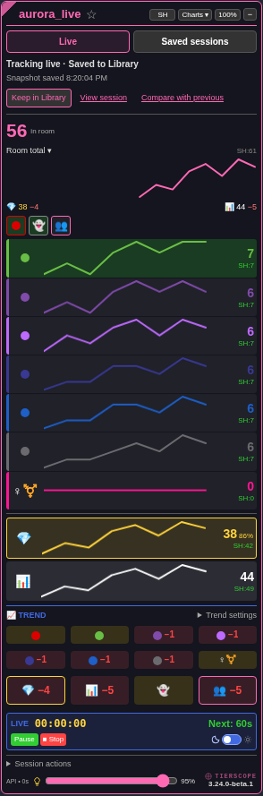
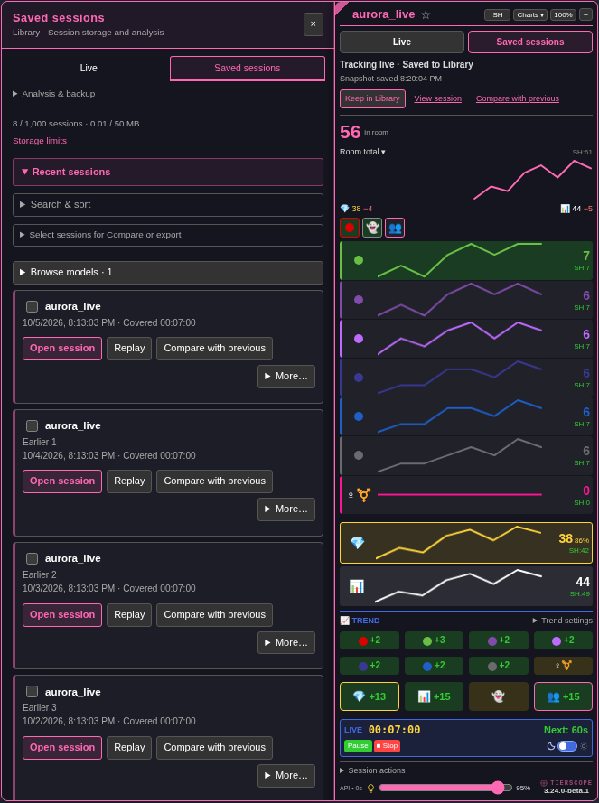
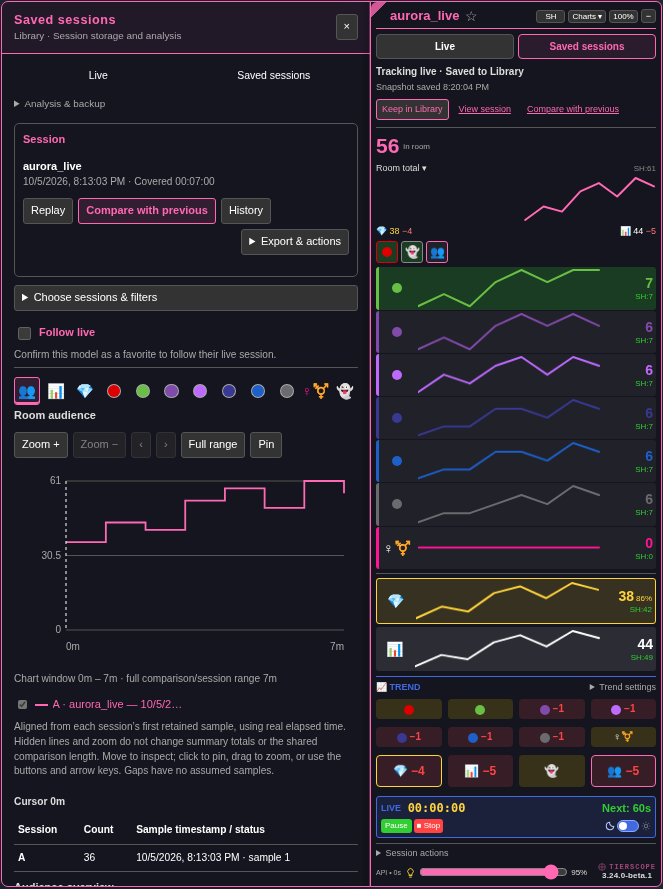
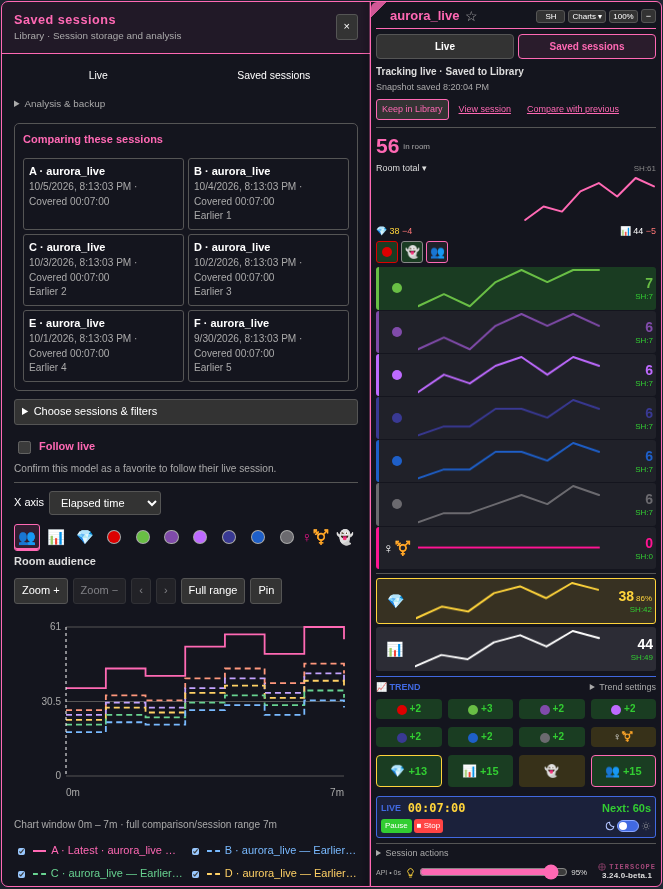

# TierScope journey redesign — 3.24.0-beta.1

[Install the beta](https://raw.githubusercontent.com/newivy2/TierScope/beta/user-journey/tierscope.user.js). Keep one enabled copy. Main remains **3.23.0**; this branch is for review.

## Start in Live

The room name, tracking status, saving status, audience and recent chart appear together in compact and expanded views. Recording still starts automatically. The first sample enables **Keep in Library**. **View session** opens the exact kept recording; another Keep updates the same compatible session.

Manual keeping captures a snapshot. New scans indicate that the saved snapshot needs updating. A confirmed favorite shows **Automatically saved**, the last successful checkpoint and any pending save. Automatic keeping retains its existing one-minute cadence and pause/Stop/navigation checkpoints. Favorite consent and storage limits are unchanged.

Pause/Resume and Stop remain nearby. Reset is separate under **Session actions**. Current-session Replay remains there as a fast path, while **Compare with previous** remains one click away in Live. Trend presets move into remembered **Trend settings**.

## Find and open a saved session

**Saved sessions** opens the recent list immediately, with model names, dates/start times and covered duration. **Browse models**, search, date filters, sorting and selection narrow the list. Search/model disclosures remember their state. The current live/replay cards remain under **This room · Keep, Compare & history**.

**Open session** shows its chart and summary. Replay, Compare with previous, History, exports, ATH and notes are attached to the selected session. The session list retains direct Replay, comparison and More actions. Import/open files, refresh and backup remain available. Nothing is deleted or migrated by this redesign.

## Compare with context

The selected model, start time, covered duration and optional title appear before chart settings. Comparisons still support six sessions, elapsed/24h axes, inspection/zoom, shared cursor, visibility controls, thresholds and following a favorite’s live recording. The latest line remains solid pink and earlier lines dashed.

## Review checklist

- Open a fresh room: waiting explanation, then current audience and tracking status.
- Keep → View session → Replay → Live; confirm tracking continues with its existing pause/Stop state.
- Keep again after new scans; confirm the existing entry updates and its title/notes survive.
- Open Saved sessions; browse recent sessions, narrow by model/date, open a chart, and compare with previous.
- Confirm a favorite; check successful automatic saving and pending-save feedback if storage is unavailable.
- Toggle Trend settings, Session actions and search; refresh and check remembered choices.
- Check dark/bright themes, compact/expanded views, drag/scale, narrow windows and the Scope’s priority over an overlapping Library.

Screenshots use synthetic fixture sessions and a fictional model. Statistics continue to use real recorded timestamps and gaps. The installed script contains no fixture hooks or page control API.
