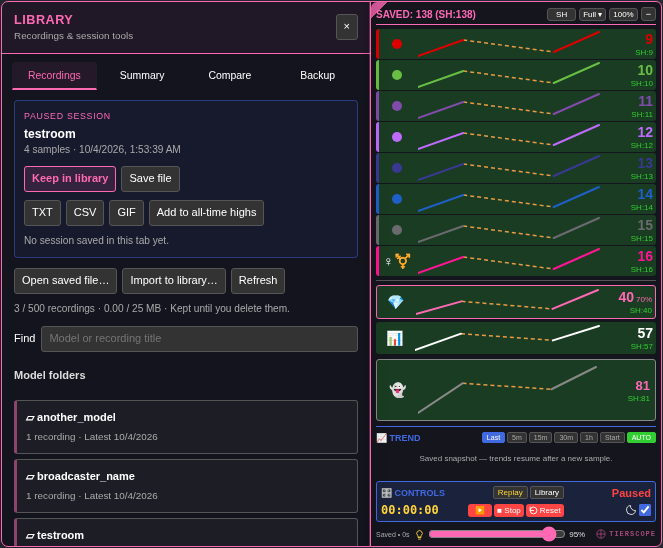

# TierScope

TierScope is a free, open-source userscript that charts how a Chaturbate room’s audience changes over time. 

---
**Current stable release: 3.12.0** · [Release notes](https://github.com/newivy2/TierScope/releases/tag/v3.12.0)

**Beta preview: 3.13.0-beta.1 — model history.** [Install the beta](https://raw.githubusercontent.com/newivy2/TierScope/beta/model-history/tierscope.user.js), then open **Library → a model folder → History overview**. Each saved recording has its own average and peak markers, with covered-time statistics and shortcuts to Summary, Replay and Compare. [Dark preview](docs/previews/model-history-dark.png) · [Bright preview](docs/previews/model-history-bright.png).
---

Open the **Library** to unfold a matching left-hand page next to the chart. Save, export, open a saved file, and browse recordings in model folders. Session summaries and comparisons are available too. Visual bugs corrected. [Build and source guide](BUILDING.md).

The **Session-High / All-Time-High** switch sits on the main header. Session highs (SH) and all-time highs (ATH) are tracked separately for each room. ATH survive session Reset and expiry; hover a high to see the exact value and its recorded time. Opening a saved file does not change these records: but you can use **Add to all-time highs** in Library to add that file's highs to its own room.

[Bright-theme preview](docs/previews/library-book-bright.png)

Charts use periodic room-data samples. Session history is stored locally through your userscript manager, so you can return to a saved session after a refresh. Replay lets you revisit that history while live tracking continues, or reopen a session file you kept for later.

## Who it’s for

- **Broadcasters:** follow audience changes during a broadcast and review the session afterward.
- **Viewers:** follow a favorite room’s audience and learn what the tier colors represent.
- **Moderators and studios:** use the charts and session summaries alongside your own observations when supporting broadcasters.

## Main features

- **Live audience tracking** — Follow viewer tiers, registered and anonymous viewers, viewers with tokens, and the room’s total audience.

- **Session and all-time highs** — Switch between **SH** and **ATH** to compare the current session with previous records for that room. Green highlights and gentle pulses mark counts reaching or breaking the selected high.

- **Interactive charts** — View the full recorded history or focus on a recent time window. Inspect individual samples and see where recording gaps occurred.

- **Smooth replay** — Replay recorded samples at an even pace, including across recording pauses. Play, pause, change speed, scrub through the timeline, or step through individual samples.

- **Saved session files** — Save sessions and reopen them later. Use **Add to all-time highs** to include a saved file’s peaks in that room’s records.

- **Session library** — Choose **Library → Keep in library** from live Controls or Replay. Recordings are organized into model folders. Keeping a fuller version of the same session updates its entry and preserves your custom name. Search, rename, replay, download or delete recordings; the library holds up to 500 recordings / 25 MB.

- **Summaries and comparison** — See audience averages and peaks together, token-holder proportions, coverage and gaps. Choose several thresholds to see time at or above each count and its percentage of covered time. Statistics use real timestamps and exclude recording gaps. Compare two recordings from their first retained samples, optionally matching their shared duration.

- **Model history (beta)** — Review one model’s saved recordings over time, with one point per recording for the selected metric’s average and peak. View all recordings or the latest 10 or 30, then select one to inspect, replay, or compare with the previous recording.

- **Backups** — Export ATH for every room and saved preferences, optionally including the library. 

- **Reports and exports** — Download a session file, CSV data, TXT summary, or animated GIF from Library. 

- **Flexible layout** — Choose compact or expanded views, collapse individual rows, resize and reposition the panel, and adjust its transparency. A moon–sun switch activate dark or bright theme.

- **Session controls** —  Automatic absence detection reduces scanning when the broadcaster is away.

Session history and all-time records are stored locally through your userscript manager. All-time highs remain separate for each room and survive session resets.

## Installation

Install [Tampermonkey](https://www.tampermonkey.net/), follow Tampermonkey’s [userscript permission instructions](https://www.tampermonkey.net/faq.php?q=Q209) for your browser so installed scripts can run, open [the official userscript](https://raw.githubusercontent.com/newivy2/TierScope/main/tierscope.user.js), and accept the installation. Refresh a Chaturbate room to start tracking.

If you used the beta, install from the official link above to follow main releases. Keep only one enabled copy of TierScope.

[Usage and development notes](DEVELOPMENT_NOTES.md) · [Report an issue](https://github.com/newivy2/TierScope/issues)

## Thanks

- **baba_oriley** — API acquisition and Replay mode.
- **checksnmale** — testing and feedback.
- **Dean McNamee** — the omggif encoder.

## License

MIT. See [LICENSE](https://github.com/newivy2/TierScope/blob/main/LICENSE).

For personal use. Not affiliated with Chaturbate.
