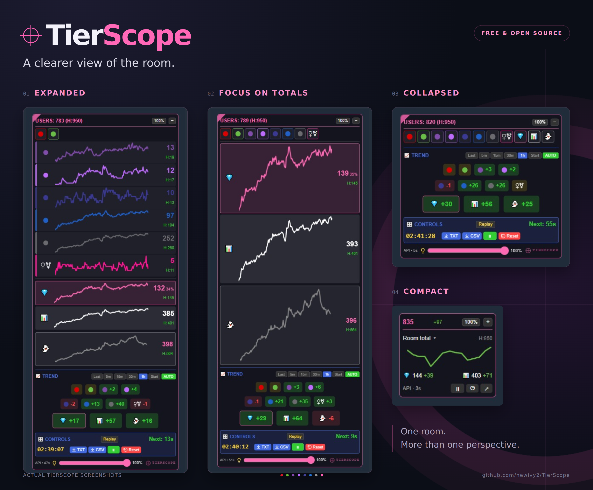

# TierScope

TierScope is a free, open-source userscript that charts how a Chaturbate room’s audience changes over time. 
**Current release: 3.3.1**

Charts use periodic room-data samples. Session history is stored locally through your userscript manager, so you can return to a saved session after a refresh. Replay lets you revisit that history while live tracking continues, or reopen a session file you kept for later.

## Who it’s for

- **Broadcasters:** follow audience changes during a broadcast and review the session afterward.
- **Viewers:** follow a favorite room’s audience and learn what the tier colors represent.
- **Moderators and studios:** use the charts and session summaries alongside your own observations when supporting broadcasters.

## What’s new since 3.1.1.0

- **Compact dashboard:** switch between Room total, With Tokens, and Registered charts, with count changes and sample age.
- **Collapsible rows:** hide tiers or totals to give the remaining charts more space.
- **Layout controls:** remembered position, size, and row visibility; a standard-size reset; adjustable background transparency; and dark or bright mode.
- **Chart views and inspection:** full history or the last 4h, 2h, 1h, 30min, or 15min; timestamp spacing, orange dashed gaps, and sample values on hover or keyboard focus.
- **Session controls:** pause or finish a session, with automatic slowdown and Stop during prolonged broadcaster absence.
- **Replay and session files:** step through saved samples, download a session file, and reopen it for review later.
- **Downloads:** animated GIFs, full retained CSV history, and TXT session summaries.
- **High-count pulses:** two gentle pulses mark a new session high or a return to it after a dip, on expanded rows and collapsed markers.

## Installation

Install [Tampermonkey](https://www.tampermonkey.net/), follow Tampermonkey’s [userscript permission instructions](https://www.tampermonkey.net/faq.php?q=Q209) for your browser so installed scripts can run, open [tierscope.user.js](https://raw.githubusercontent.com/newivy2/TierScope/main/tierscope.user.js), and accept the installation. Refresh a Chaturbate room to start tracking.

[Usage and development notes](DEVELOPMENT_NOTES.md) · [Report an issue](https://github.com/newivy2/TierScope/issues)

## Thanks

- **baba_oriley** — API acquisition and Replay mode.
- **checksnmale** — testing and feedback.
- **Dean McNamee** — the omggif encoder.

## License

MIT. See [LICENSE](https://github.com/newivy2/TierScope/blob/main/LICENSE).

For personal use. Not affiliated with Chaturbate.
