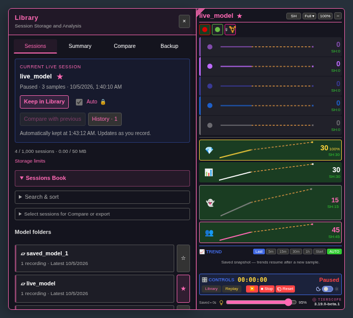

# TierScope

TierScope is a free, open-source userscript that charts how a Chaturbate room’s audience changes over time. 

---

## Installation

Install [Tampermonkey](https://www.tampermonkey.net/), follow Tampermonkey’s [userscript permission instructions](https://www.tampermonkey.net/faq.php?q=Q209) for your browser so installed scripts can run, open [the official userscript](https://raw.githubusercontent.com/newivy2/TierScope/main/tierscope.user.js), and accept the installation. Refresh a Chaturbate room to start tracking.

If you used the beta, install from the official link above to follow main releases. Keep only one enabled copy of TierScope.

[Usage and development notes](DEVELOPMENT_NOTES.md) · [Report an issue](https://github.com/newivy2/TierScope/issues)

---

**Current stable release: 3.21.0** · [Release notes](https://github.com/newivy2/TierScope/releases/tag/v3.21.0) · [Follow live guide](docs/follow-live.md)

**Beta for review: 3.22.0-beta.1** — [Library transparency and chart metric strip](docs/library-chart-controls-beta.md).

---

Open the **Library** to unfold a left-hand page next to the charts. Follow your favorites, start storing sessions and use the Compare feature with up to 6 stored sessions. Session summaries are available too. [Build and source guide](BUILDING.md).

The **Session-High / All-Time-High** switch sits on the main header. Session highs (SH) and all-time highs (ATH) are tracked separately for each room. ATH survive session Reset and expiry; hover a high to see the exact value and its recorded time. Opening a saved file does not change these records: but you can use **Add to all-time highs** in Library to add that file's highs to its own room.

[Bright-theme preview](docs/previews/sessions-book-expanded-bright.png)

Charts use periodic room-data samples. Session history is stored locally through your userscript manager, so you can return to a saved session after a refresh. Replay lets you revisit that history while live tracking continues, or reopen a session file you kept for later.

## Who it’s for

- **Broadcasters:** follow audience changes during a broadcast and review the session afterward.
- **Viewers:** follow a favorite room’s audience and learn what the tier colors represent.
- **Moderators and studios:** use the charts and session summaries alongside your own observations when supporting broadcasters.

## Main features

- **Live audience tracking** — See viewer tiers, token holders, registered and anonymous viewers, and the room’s total audience.
- **Audience trends** — See which audience groups are growing or shrinking over time.
- **Session and all-time highs** — Track each room’s audience records, with highlights when counts reach or break a high.
- **Interactive charts** — Explore audience history, zoom in and inspect individual samples.
- **Smooth replay** — Replay live or saved sessions with adjustable speed and timeline controls.
- **Saved session files** — Save sessioins to your device and reopen them later.
- **Session library** — Keep sessions in model folders and update saved sessions as they grow.
- **Favorite models** — Choose favorite models and enable automatic session saving while tracking them.
- **Summaries and comparison** — Review audience statistics and compare up to six sessions, with live updates for favorites.
- **Model history** — Follow a model’s audience averages and peaks across saved sessions.
- **Library organization** — Find sessions by model or date, add notes, and import or export in bulk.
- **Backups** — Back up and restore your library, all-time highs and preferences.
- **Reports and exports** — Export session data as CSV, TXT reports or animated GIFs.
- **Flexible layout** — Resize and move the panel, collapse tiers, switch views and choose a dark or bright theme.
- **Session controls** — Pause, stop or reset tracking, with automatic pauses when the broadcaster is away.

For controls, settings and detailed behavior, see the [usage and development notes](DEVELOPMENT_NOTES.md).

Session history and all-time records are stored locally through your userscript manager. All-time highs remain separate for each room and survive session resets.

## Thanks

- **baba_oriley** — API acquisition and Replay mode.
- **checksnmale** — testing and feedback.
- **Dean McNamee** — the omggif encoder.

## License

MIT. See [LICENSE](https://github.com/newivy2/TierScope/blob/main/LICENSE).

For personal use. Not affiliated with Chaturbate.
